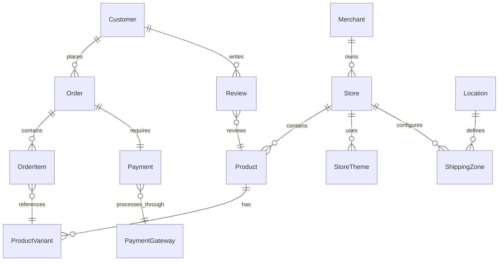

# Data Model: Africa-Targeted E-Commerce Platform

## Core Entity Relationships

## Entity Definitions

### Merchant

**Purpose**: African small business owners, artisans, farmers, and entrepreneurs who create and manage online stores

**Attributes**:

- `id` (UUID, primary key)
- `email` (string, unique, validated)
- `phone` (string, E.164 format, required for verification)
- `first_name` (string, required)
- `last_name` (string, required)
- `business_name` (string, nullable)
- `business_type` (enum: individual, sme, cooperative, enterprise)
- `verification_status` (enum: pending, verified, suspended)
- `verification_documents` (JSONB: ID type, ID number, business license)
- `preferred_language` (string, ISO 639-1)
- `country_code` (string, ISO 3166-1 alpha-2)
- `timezone` (string, IANA timezone)
- `created_at` (timestamp)
- `updated_at` (timestamp)
- `last_login_at` (timestamp, nullable)

**Validation Rules**:

- Email must be unique and valid format
- Phone must be verified via OTP
- At least one store required for active merchant
- Business documents required for verification_status = verified

**State Transitions**:

- pending → verified (after document verification)
- verified → suspended (policy violation)
- suspended → verified (appeal approved)

### Store

**Purpose**: Merchant's online presence with design templates, multi-channel integration settings, and performance analytics

**Attributes**:

- `id` (UUID, primary key)
- `merchant_id` (UUID, foreign key → Merchant.id)
- `name` (string, required, 1-100 chars)
- `slug` (string, unique, URL-safe)
- `domain` (string, nullable, custom domain)
- `subdomain` (string, unique, auto-generated)
- `description` (text, nullable)
- `logo_url` (string, nullable)
- `banner_url` (string, nullable)
- `theme_id` (UUID, foreign key → StoreTheme.id)
- `theme_config` (JSONB: colors, fonts, layout settings)
- `currency` (string, ISO 4217, required)
- `languages` (string[], ISO 639-1 codes)
- `business_address` (JSONB: street, city, state, country, postal_code)
- `contact_email` (string, customer service)
- `contact_phone` (string, customer service)
- `social_links` (JSONB: facebook, instagram, twitter, whatsapp)
- `seo_settings` (JSONB: meta_title, meta_description, keywords)
- `is_active` (boolean, default true)
- `created_at` (timestamp)
- `updated_at` (timestamp)

**Validation Rules**:

- Store slug must be unique across platform
- Custom domain must be verified via DNS
- Currency must be supported in merchant's country
- At least one language required

### Product

**Purpose**: Items sold on the platform with variants, pricing in multiple currencies, inventory levels, shipping requirements, and cultural/seasonal relevance

**Attributes**:

- `id` (UUID, primary key)
- `store_id` (UUID, foreign key → Store.id)
- `title` (string, required, 1-200 chars)
- `description` (text, nullable)
- `short_description` (string, nullable, 1-500 chars)
- `product_type` (string, nullable, for categorization)
- `vendor` (string, nullable)
- `tags` (string[], searchable keywords)
- `status` (enum: draft, active, archived)
- `seo_title` (string, nullable)
- `seo_description` (string, nullable)
- `handle` (string, URL-safe, unique within store)
- `images` (JSONB: array of {url, alt_text, sort_order})
- `videos` (JSONB: array of {url, thumbnail, duration})
- `ai_generated` (boolean, default false)
- `cultural_relevance` (JSONB: seasons, holidays, regions)
- `shipping_required` (boolean, default true)
- `weight` (decimal, grams)
- `dimensions` (JSONB: length, width, height in cm)
- `hs_code` (string, nullable, for customs)
- `origin_country` (string, ISO 3166-1 alpha-2)
- `created_at` (timestamp)
- `updated_at` (timestamp)

**Validation Rules**:

- Title required and unique within store
- Handle auto-generated from title if not provided
- At least one product variant required
- Images must be optimized for bandwidth

### ProductVariant

**Purpose**: Specific variations of products with pricing, inventory, and attributes

**Attributes**:

- `id` (UUID, primary key)
- `product_id` (UUID, foreign key → Product.id)
- `title` (string, required)
- `sku` (string, nullable, unique within store)
- `barcode` (string, nullable)
- `price` (decimal, in store currency)
- `compare_at_price` (decimal, nullable, original price)
- `cost_price` (decimal, nullable, for profit calculations)
- `inventory_quantity` (integer, default 0)
- `inventory_policy` (enum: deny, continue)
- `track_inventory` (boolean, default true)
- `requires_shipping` (boolean, default true)
- `weight` (decimal, grams, nullable)
- `position` (integer, sort order)
- `option1` (string, nullable, e.g., "Size")
- `option2` (string, nullable, e.g., "Color")
- `option3` (string, nullable, e.g., "Material")
- `image_id` (string, nullable, reference to images array)
- `created_at` (timestamp)
- `updated_at` (timestamp)

**Validation Rules**:

- SKU unique within store if provided
- Price must be positive
- Inventory quantity cannot be negative
- At least one option value required if product has variants

### Customer

**Purpose**: African consumers shopping across the platform with location, payment method preferences, language settings, and purchase history

**Attributes**:

- `id` (UUID, primary key)
- `email` (string, nullable, unique if provided)
- `phone` (string, nullable, E.164 format)
- `first_name` (string, nullable)
- `last_name` (string, nullable)
- `accepts_marketing` (boolean, default false)
- `preferred_language` (string, ISO 639-1)
- `country_code` (string, ISO 3166-1 alpha-2)
- `currency` (string, ISO 4217)
- `default_address_id` (UUID, nullable, foreign key → Address.id)
- `customer_type` (enum: guest, registered, business)
- `business_name` (string, nullable)
- `tax_id` (string, nullable)
- `notes` (text, nullable, merchant notes)
- `tags` (string[], for segmentation)
- `total_spent` (decimal, lifetime value)
- `orders_count` (integer, default 0)
- `verified_at` (timestamp, nullable)
- `created_at` (timestamp)
- `updated_at` (timestamp)
- `last_order_at` (timestamp, nullable)

**Validation Rules**:

- Either email or phone required for contact
- Email unique across platform if provided
- Phone verified for security-sensitive operations

### Address

**Purpose**: Shipping and billing addresses with support for African addressing systems including landmarks

**Attributes**:

- `id` (UUID, primary key)
- `customer_id` (UUID, foreign key → Customer.id)
- `type` (enum: shipping, billing)
- `first_name` (string, required)
- `last_name` (string, required)
- `company` (string, nullable)
- `address1` (string, required)
- `address2` (string, nullable)
- `landmark` (string, nullable, African addressing)
- `city` (string, required)
- `state` (string, nullable)
- `postal_code` (string, nullable)
- `country_code` (string, ISO 3166-1 alpha-2)
- `phone` (string, nullable)
- `is_default` (boolean, default false)
- `latitude` (decimal, nullable)
- `longitude` (decimal, nullable)
- `delivery_instructions` (text, nullable)
- `created_at` (timestamp)
- `updated_at` (timestamp)

**Validation Rules**:

- Only one default address per customer per type
- Country code must match supported countries
- Landmark field encouraged for African addresses

### Order

**Purpose**: Purchase transactions with payment method, shipping details, tracking information, and dispute resolution status

**Attributes**:

- `id` (UUID, primary key)
- `order_number` (string, unique, human-readable)
- `store_id` (UUID, foreign key → Store.id)
- `customer_id` (UUID, foreign key → Customer.id)
- `email` (string, for guest orders)
- `phone` (string, for notifications)
- `status` (enum: pending, confirmed, processing, shipped, delivered, cancelled, refunded)
- `financial_status` (enum: pending, paid, partially_paid, refunded, voided)
- `fulfillment_status` (enum: unfulfilled, partial, fulfilled)
- `currency` (string, ISO 4217)
- `subtotal` (decimal, before tax and shipping)
- `tax_total` (decimal, calculated tax)
- `shipping_total` (decimal, shipping cost)
- `discount_total` (decimal, applied discounts)
- `total` (decimal, final amount)
- `shipping_address` (JSONB, address details)
- `billing_address` (JSONB, address details)
- `shipping_method` (string, carrier and service)
- `tracking_number` (string, nullable)
- `tracking_url` (string, nullable)
- `notes` (text, nullable, customer notes)
- `tags` (string[], for organization)
- `source` (enum: web, mobile, whatsapp, facebook, api)
- `utm_source` (string, nullable, marketing attribution)
- `cancelled_at` (timestamp, nullable)
- `cancelled_reason` (string, nullable)
- `processed_at` (timestamp, nullable)
- `created_at` (timestamp)
- `updated_at` (timestamp)

**Validation Rules**:

- Order number unique across platform
- Totals must reconcile with line items
- Shipping address required unless digital products only
- Email required for guest orders

### OrderItem

**Purpose**: Individual line items within orders

**Attributes**:

- `id` (UUID, primary key)
- `order_id` (UUID, foreign key → Order.id)
- `product_variant_id` (UUID, foreign key → ProductVariant.id)
- `quantity` (integer, must be positive)
- `price` (decimal, price at time of order)
- `total` (decimal, calculated from quantity × price)
- `product_title` (string, snapshot at order time)
- `variant_title` (string, snapshot at order time)
- `sku` (string, nullable, snapshot)
- `weight` (decimal, nullable, for shipping)
- `requires_shipping` (boolean)
- `gift_card` (boolean, default false)
- `taxable` (boolean, default true)
- `properties` (JSONB, custom properties like engraving)
- `created_at` (timestamp)

**Validation Rules**:

- Quantity must be positive integer
- Price snapshot preserved for order history
- Total must equal quantity × price

### Payment

**Purpose**: Transaction records including mobile money transactions, cash-on-delivery confirmations, and cross-border payment handling

**Attributes**:

- `id` (UUID, primary key)
- `order_id` (UUID, foreign key → Order.id)
- `gateway_id` (UUID, foreign key → PaymentGateway.id)
- `transaction_id` (string, gateway transaction reference)
- `status` (enum: pending, processing, success, failed, cancelled, refunded)
- `amount` (decimal, payment amount)
- `currency` (string, ISO 4217)
- `exchange_rate` (decimal, nullable, for currency conversion)
- `gateway_fee` (decimal, gateway processing fee)
- `method` (enum: card, mobile_money, bank_transfer, cash_on_delivery, crypto)
- `method_details` (JSONB: card last 4, mobile number, etc.)
- `processed_at` (timestamp, nullable)
- `gateway_response` (JSONB, full gateway response for debugging)
- `failure_reason` (string, nullable)
- `refund_amount` (decimal, default 0)
- `refunded_at` (timestamp, nullable)
- `metadata` (JSONB, additional payment context)
- `created_at` (timestamp)
- `updated_at` (timestamp)

**Validation Rules**:

- Amount must be positive
- Transaction ID unique per gateway
- Gateway response stored for audit trail

### PaymentGateway

**Purpose**: Configuration for various payment providers optimized for African markets

**Attributes**:

- `id` (UUID, primary key)
- `name` (string, e.g., "M-Pesa", "Paystack")
- `provider` (enum: paystack, flutterwave, mpesa, mtn_momo, airtel_money, paypal)
- `countries` (string[], ISO 3166-1 alpha-2 codes)
- `currencies` (string[], ISO 4217 codes)
- `methods` (string[], payment methods supported)
- `is_active` (boolean, default true)
- `is_test_mode` (boolean, default false)
- `configuration` (JSONB, encrypted credentials and settings)
- `fee_structure` (JSONB, transaction fees)
- `limits` (JSONB, min/max transaction amounts)
- `webhook_url` (string, for status updates)
- `created_at` (timestamp)
- `updated_at` (timestamp)

**Validation Rules**:

- Configuration encrypted for security
- Countries and currencies must align with provider capabilities
- Webhook URL validated for HTTPS

### Review

**Purpose**: Customer feedback system with verified purchase confirmation, community moderation, and merchant response capabilities

**Attributes**:

- `id` (UUID, primary key)
- `product_id` (UUID, foreign key → Product.id)
- `customer_id` (UUID, foreign key → Customer.id)
- `order_id` (UUID, nullable, foreign key → Order.id)
- `rating` (integer, 1-5 scale)
- `title` (string, nullable, review headline)
- `body` (text, nullable, review content)
- `verified_purchase` (boolean, linked to order)
- `helpful_count` (integer, default 0)
- `images` (JSONB, array of customer photos)
- `status` (enum: pending, published, hidden, spam)
- `merchant_response` (text, nullable)
- `responded_at` (timestamp, nullable)
- `published_at` (timestamp, nullable)
- `created_at` (timestamp)
- `updated_at` (timestamp)

**Validation Rules**:

- Rating required, 1-5 integer
- Verified purchase preferred for credibility
- Spam detection before publishing

### Location

**Purpose**: Geographic data for shipping, pricing, and localization including country-specific regulations, currency zones, and logistics networks

**Attributes**:

- `id` (UUID, primary key)
- `country_code` (string, ISO 3166-1 alpha-2, primary key)
- `country_name` (string, localized)
- `currency` (string, ISO 4217)
- `languages` (string[], ISO 639-1 codes)
- `timezone` (string, primary timezone)
- `calling_code` (string, international dialing)
- `vat_rate` (decimal, nullable, default tax rate)
- `shipping_zones` (JSONB, domestic shipping configuration)
- `payment_methods` (string[], available payment methods)
- `logistics_partners` (JSONB, local delivery companies)
- `regulations` (JSONB, import/export rules)
- `afcfta_member` (boolean, African trade agreement)
- `created_at` (timestamp)
- `updated_at` (timestamp)

**Validation Rules**:

- Country code unique and valid ISO format
- Currency must be supported by payment gateways
- Regulations updated per trade agreements

### ShippingZone

**Purpose**: Geographic regions with defined shipping rates and delivery options

**Attributes**:

- `id` (UUID, primary key)
- `store_id` (UUID, foreign key → Store.id)
- `name` (string, e.g., "West Africa", "Local Delivery")
- `countries` (string[], ISO 3166-1 alpha-2 codes)
- `states` (string[], nullable, specific states/regions)
- `cities` (string[], nullable, specific cities)
- `shipping_methods` (JSONB, array of rate configurations)
- `free_shipping_threshold` (decimal, nullable)
- `is_active` (boolean, default true)
- `created_at` (timestamp)
- `updated_at` (timestamp)

**Validation Rules**:

- At least one location specification required
- Countries must exist in Location table
- Rate configurations must include calculation method

### StoreTheme

**Purpose**: Pre-designed templates optimized for African e-commerce

**Attributes**:

- `id` (UUID, primary key)
- `name` (string, theme display name)
- `description` (text, theme description)
- `category` (string, e.g., "fashion", "electronics", "crafts")
- `preview_image` (string, theme screenshot URL)
- `is_premium` (boolean, requires payment)
- `price` (decimal, nullable, theme cost)
- `template_files` (JSONB, theme structure and assets)
- `default_config` (JSONB, default color/font settings)
- `supported_features` (string[], theme capabilities)
- `african_optimized` (boolean, optimized for African markets)
- `mobile_optimized` (boolean, mobile-first design)
- `rtl_support` (boolean, right-to-left language support)
- `is_active` (boolean, default true)
- `created_at` (timestamp)
- `updated_at` (timestamp)

**Validation Rules**:

- Preview image required for theme selection
- Template files validated for security
- African optimization preferred

## Indexes and Performance

### Primary Indexes

- `merchant.email` (unique)
- `store.slug` (unique)
- `product.handle + store_id` (composite unique)
- `order.order_number` (unique)
- `customer.email` (unique, partial for non-null)

### Performance Indexes

- `product.store_id + status` (product listings)
- `order.store_id + created_at` (order history)
- `order.customer_id + created_at` (customer orders)
- `payment.order_id + status` (payment lookup)
- `review.product_id + published_at` (product reviews)

### Search Indexes

- `product.title, description, tags` (full-text search)
- `store.name, description` (store search)
- `customer.first_name, last_name, email` (customer lookup)

## Data Validation and Constraints

### Multi-Tenancy

- All merchant-specific data isolated by `store_id`
- Row-level security policies enforce data isolation
- Shared reference data (locations, themes) accessible across tenants

### Audit Trail

- All financial tables include created_at/updated_at
- Payment transactions immutable after processing
- Order modifications tracked in separate audit table

### Data Retention

- Customer data retained per privacy policy (7 years default)
- Anonymous analytics data retained indefinitely
- Payment PCI data purged after retention period

---

**Data Model Status**: Complete - All entities defined with validation rules and relationships established
